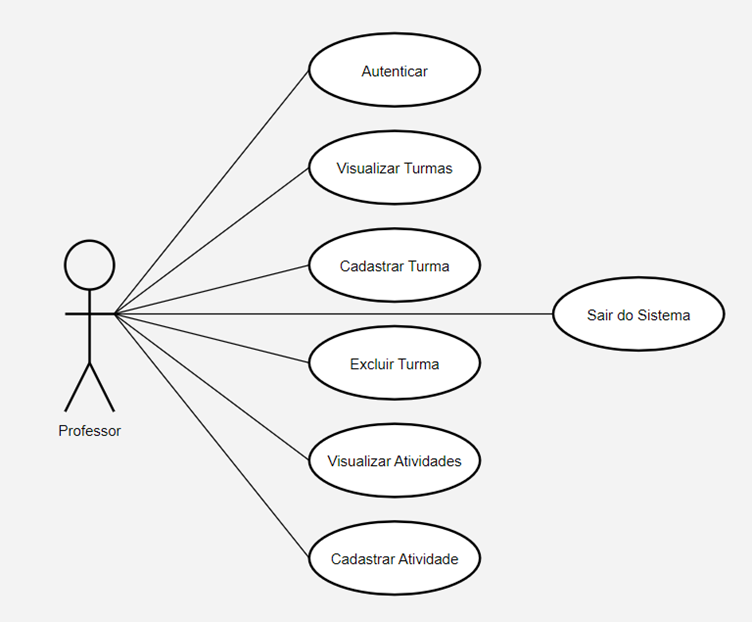
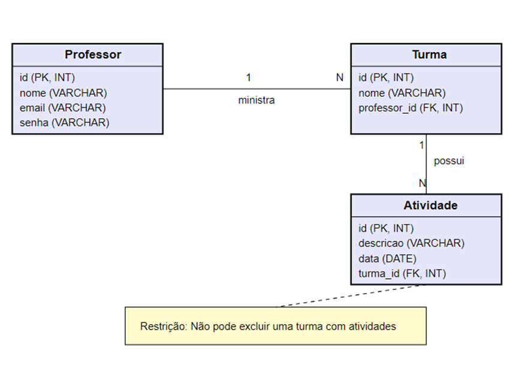

# Sistema de Controle de Turma para Professores 📝
Situação problema: desenvolver um sistema web ou desktop que permitirá ao professor se autenticar em
um sistema para visualizar, registrar, excluir suas turmas, assim como registrar atividades para as suas
turmas e sair do sistema.
* O ator Professor interage com todos os casos de uso.
* O caso de uso Autenticar deve ser realizado antes que o professor possa realizar qualquer outra ação.
* Visualizar Turmas, Registrar Turmas, Excluir Turmas, Visualizar atividades e Registrar Atividades são casos de uso que podem ocorrer após a autenticação.
* Sair do Sistema pode ocorrer a qualquer momento após a autenticação.

## Diagrama de caso de uso
Diagrama de caso de uso representando os atores, casos de uso e relacionamentos

## Diagrama entidade e relacionamento (DER) 
Diagrama entidade e relacionamento (DER) contendo as tabelas, relacionamentos, campos, chaves primárias e estrangeiras e os tipos de dados de acordo com o SGBD (Sistema de Gerenciamento de Banco de Dados) utilizado

